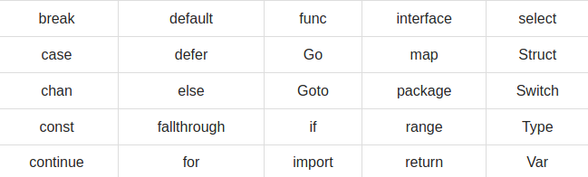

## Syntax of Golang

### Building Blocks of Go programming

#### 1. Tokens

* Constants
* Literals
* Symbols
* Strings
* Keywords
* Identifiers

#### 2. Line Separator

* EOL is meant as ; equivalent of C program. Thus, we need to start the block structure right after the definiton rather than going to the next line.

#### 3. Comments

```go
/* Multi 
line 
comments */
// Single line Comment
```

#### 4. Identifiers

#### 5. Keywords



#### 6. Whitespaces
